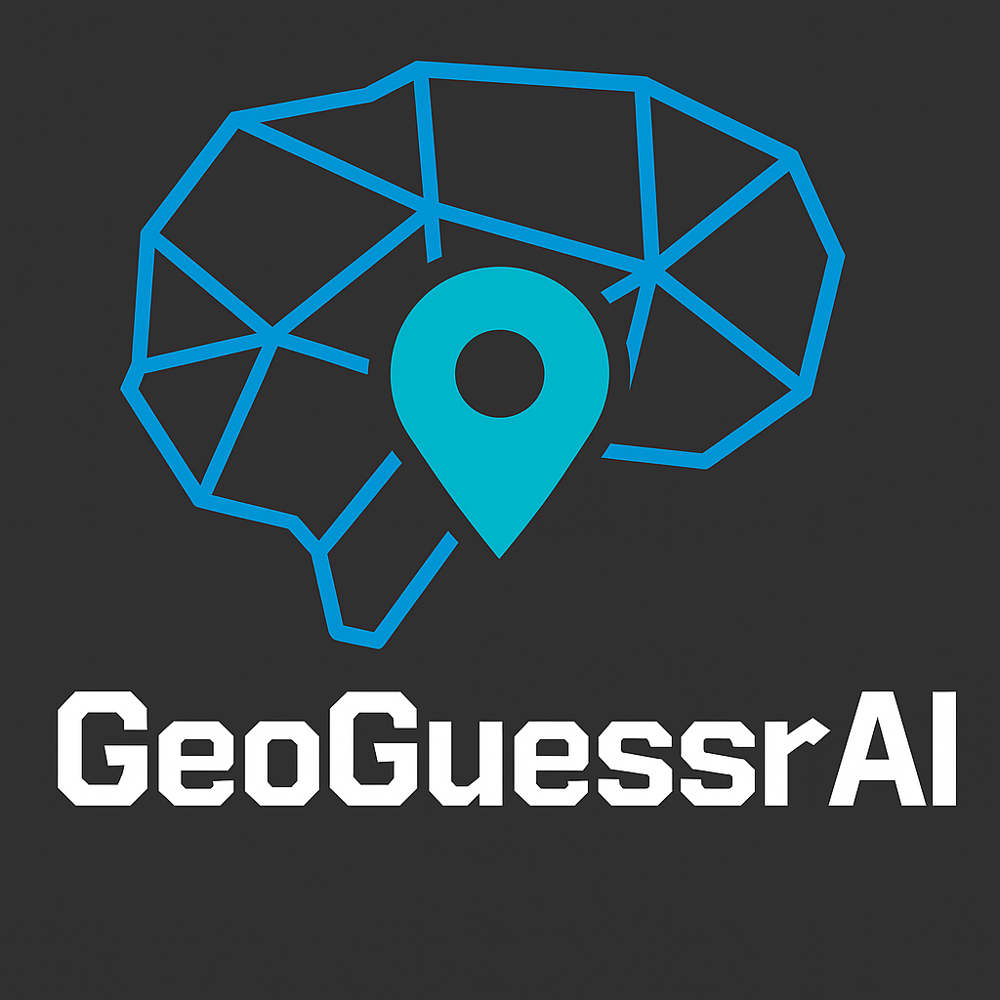

# Geoguessr AI

<div align="center">


[](https://opensource.org/licenses/MIT)
[](https://img.shields.io/badge/version-0.0.1-blue)


</div>

<details> 
<summary><b>📋 Table of contents </b></summary>

- [Geoguessr AI](#geoguessr-ai)
  - [Description](#description)
  - [🛠️ Prerequisites](#%EF%B8%8F-prerequisites)
  - [Getting started](#getting-started)
  - [Usage](#usage)
    - [📖 Generate Documentation Site](#-generate-documentation-site)
  - [Testing](#testing)
  - [Team](#team)
    - [License](#license)

</details>

## Description

🌍CV-based AI model that is able to predict location (coordinates) of picture in world🌏

<!-- TODO: Provide a brief overview of what this project does and its key features. Please add pictures or videos of the application -->

## 🛠️ Prerequisites

- **Git**: Ensure that git is installed on your machine. [Download Git](https://git-scm.com/downloads)
- **Python 3.12**: Required for the project. [Download Python](https://www.python.org/downloads/)
- **UV**: Used for managing Python environments. [Install UV](https://docs.astral.sh/uv/getting-started/installation/)
- **Docker** (optional): For DevContainer development. [Download Docker](https://www.docker.com/products/docker-desktop)

## Getting started

1. **Clone the repository**:

   ```sh
   git clone https://github.com/CogitoNTNU/geoguessr-ai.git
   cd geoguessr-ai
   ```

1. **Install dependencies**:

   ```sh
   uv sync
   ```

1. **Configure environment variables**:
   This project uses environment variables for configuration. Copy the example environment file to create your own:

   ```sh
   cp .env.example .env
   ```

   Then edit the `.env` file to include your specific configuration settings.

1. **Set up pre commit** (only for development):

   ```sh
   uv run pre-commit install
   ```

## Usage

To run the project, run the following command from the root directory of the project:

```bash

```

<!-- TODO: Instructions on how to run the project and use its features. -->

### 🏞️ Help us collect pictures to train on🌉

Go to the [How To Collect Pictures](data/street_view_images_collection/HowToCollectPictures.md) for a step by step guide for how to help us collect more pictures. Your help is much appreciated!

### 📖 Generate Documentation Site

To build and preview the documentation site locally:

```bash
uv run mkdocs build
uv run mkdocs serve
```

This will build the documentation and start a local server at [http://127.0.0.1:8000/](http://127.0.0.1:8000/) where you can browse the docs and API reference. Get the documentation according to the lastes commit on main by viewing the `gh-pages` branch on GitHub: [https://cogitontnu.github.io/geoguessr-ai/](https://cogitontnu.github.io/geoguessr-ai/).

## Testing

To run the test suite, run the following command from the root directory of the project:

```bash
uv run pytest --doctest-modules --cov=src --cov-report=html
```

## Team

This project would not have been possible without the hard work and dedication of all of the contributors. Thank you for the time and effort you have put into making this project a reality.

<table align="center">
  <tr>
    <td align="center">
        <a href="https://github.com/danielnhansen">
            <br />
            <sub><b>Daniel Neukirch Hansen</b></sub>
        </a>
    </td>
    <td align="center">
        <a href="https://github.com/jmnorheim">
            <br />
            <sub><b>Jens Martin Norheim Berget</b></sub>
        </a>
    </td>
    <td align="center">
        <a href="https://github.com/mvbryne">
            <br />
            <sub><b>Magnus Bryne</b></sub>
        </a>
    </td>
    <td align="center">
        <a href="https://github.com/sondrpe">
            <br />
            <sub><b>Sondre Pettersen</b></sub>
        </a>
    </td>
    <td align="center">
        <a href="https://github.com/perhber">
            <br />
            <sub><b>Per Henrik Bergene Holm</b></sub>
        </a>
    </td>
    <td align="center">
        <a href="https://github.com/Parleenb">
            <br />
            <sub><b>Parleen Brar</b></sub>
        </a>
    </td>
    <td align="center">
        <a href="https://github.com/RomseBoms">
            <br />
            <sub><b>Romeo Henriksen</b></sub>
        </a>
    </td>
    <td align="center">
        <a href="https://github.com/Hako2807">
            <br />
            <sub><b>Håkon Støren</b></sub>
        </a>
    </td>
    <td align="center">
        <a href="https://github.com/Vetlets05">
            <br />
            <sub><b>Vetle Støren</b></sub>
        </a>
    </td>
  </tr>
</table>


### License

______________________________________________________________________

Distributed under the MIT License. See `LICENSE` for more information.
