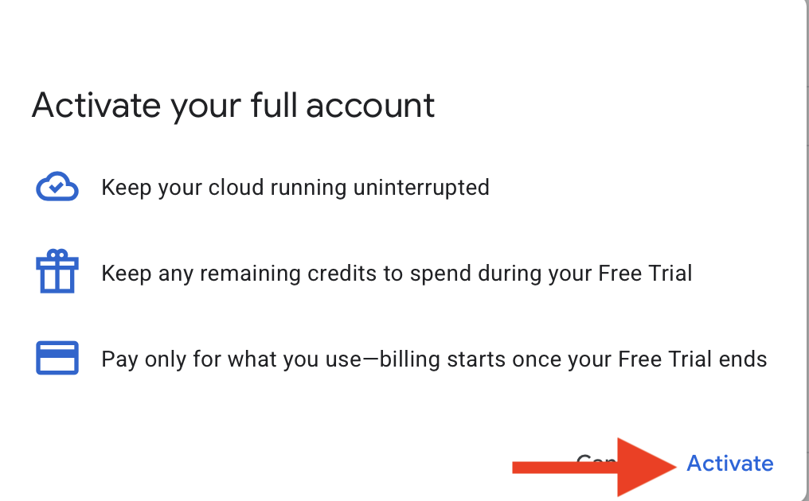

# How To Collect The Pictures From Google Streetview

### This is a step by step guide to collect the pictures that are needed to train our GeoGuessr AI model.

## Step 1 — Create a .env file

1. Go to the outer most folder of our project
1. Make a file with the name ".env"

## Step 2 — Go to google and get the API key

1. Go to "https://cloud.google.com"
1. Click on the "Console"

## Step 3 — Create a project

1. Create a project inside of Google cloud

## Step 4 — Project creation and naming

1. Name the project something (your choice)
1. And then create the project!

## Step 5 — Locate Street View Static API

1. After creating, you should come to the cloud overview/dashboard page
1. In the search field at the top, type "Street View Static API"
1. Click on the first choice, like in the picture

## Step 6 — Enable the API

1. Enable the google street view static api

## Step 7 — Terms and agreements

1. Make sure you are using the intended Google account you wish to use
1. Hit the agree and continue button

## Step 8 — Payment method

1. Add payment method

## Step 9 — Start free

1. After adding the card then click the start free

## Step 10 — Verifying payment method

1. Verifying the payment method
1. Follow the steps of your bank

## Step 11 — Copy and get the API key

1. Copy the API key
1. Paste the API key into the ".env" file you created earlier
1. It should look like this in the file: GOOGLE_MAPS_KEY="Your key, switch it here in the string" (do NOT push this file to Github)

## Step 12 — Continue

1. Click the "Go to Google Maps Platform"
1. Click the "maybe later"
1. Optional: Restrict the key, but make sure it doesn't get in the way of the data collection

## Step 13 — Activate the extra credits

1. Click the "Activate" button
1. This will give us the opportunity to collect around 40K more pictures per account **For Free**

## Step 14 — Activate

1. Click the "Activate" button

## Step 15 — Activate

1. Optional: set a budget alert
1. Click the "Continue" button

## Now finished with the Google API key, moving on to how to run the script:

## Step 1 - Run the script

### Important:

Git pull the latest changes, and make sure you are the only one running the script, only ONE person can run the script at a time!
Make sure to give everyone a heads up in our Slack-channel when you run the script!
This is to make sure we get all the pictures and no overlap in the collection.

1. Activate venv or create with `uv venv`
1. Make sure you have the lasted dependencies updated and installed
1. Make sure the terminal is in the outer most folder
1. Run `uv run data/street_view_images_collection/main.py`
   1. Select if you have the extra credits with "y" or "n" or other key if you don't have
   1. Let it run undisturbed! (if you are using a laptop, make sure it does not go into sleep mode, plug it in and turn off sleeping after inactivity)
   1. The script will give some status updates when it runs, you can use this to see how it's doing
1. Thanks for the cooperation!
