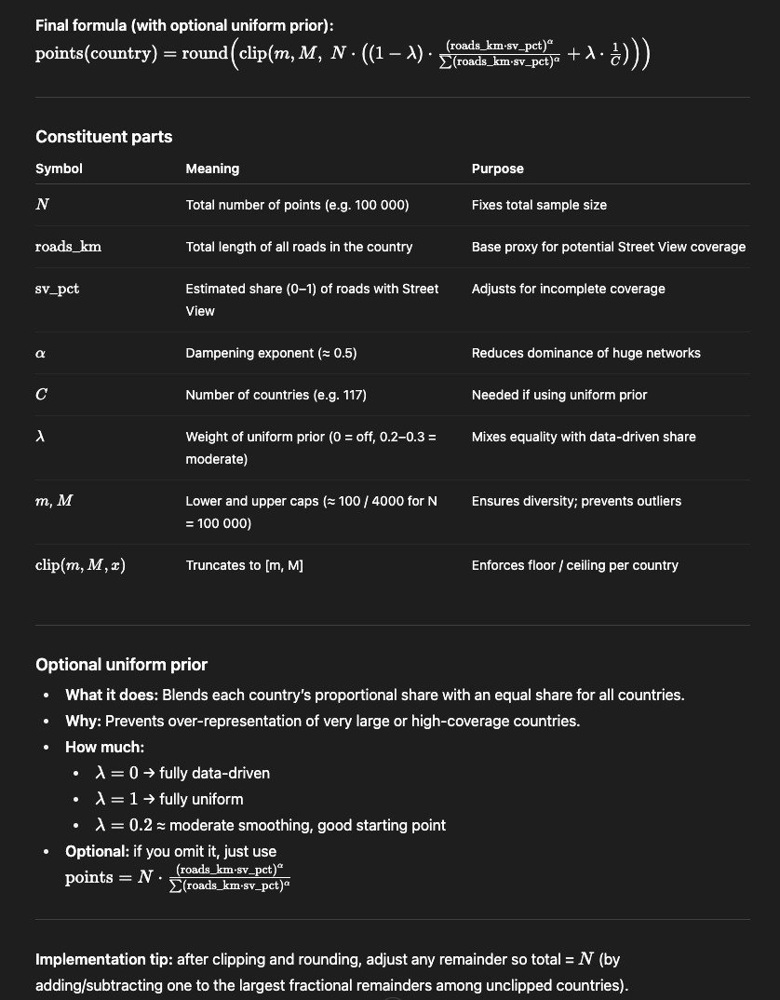

# Data Collection Guide

## Overview

I am creating an AI model that can play the famous geography game Geoguesssr. For the data collection I want to collect images from 100 000 unique Street View locations. To create a good and balanced dataset I am envisioning the following steps:

## Collection Steps

### 1. Point Allocation by Country

I need to determine what number of points (street view locations) I will place in each of the 117 countries with street view coverage. This calculation will be based on what is shown in the picture below:

Om vi får nøyaktig 100 000 points totalt er ikke så nøye.

### 2. Uniform Point-Placement Algorithm

I will create an algorithm to place points uniformly inside the administrative boundaries of each country, so called "geocells", which are fetched from the GADM database.

### 3. Street View Point Generation

After I have determined the number of points I need in each country (actual street view locations), as well as have the algorithm to place candidate points uniformly, I will create the actual street view points by doing:

#### 3.1. Calculate Conversion Rate

Placing a number of points uniformly inside a countrys geocell, calling the Google Street View metadata endpoint (which gives you actual street view locations) within a radius of 1000 meters from a candidate point (that I generated using the uniform algorithm), and finding out what percentage of the candidate points turn into actual street view points. To find a suitable number of points to generate to obtain a stable conversion rate percentage I will need to create a script that does this in a smart way.

#### 3.2. Generate Required Candidate Points

Based on this percentage, I will create the number of candidate points required to get the desired number of street view points within that country. If I for example find out that I want 1000 points inside Norway, and the conversion rate is 30%, I will need to generate 3000 candidate points inside Norway.

#### 3.3. Generate and Store Points

Running script to generate points and store them for each country.

### 3.4 Add additional points in cities and besides tourist-attractions/monuments

As you are more often placed in large cities on Geoguessr I will create a list of for example the 5-10 largest cities within each country, and use the ADM-1 boundary of that city to generate more points within that city. This will likely increase the performance considerably. I will also place a few points next to the most famous tourist attractions or monuments within each country as you are often placed there in GeoGuessr.

### 4. Image Collection

Lastly, we will need to create a script to call the Google Maps Static Street View API to fetch actual pictures (4 pictures in each direction, 0 pitch), as well as metadata, for all locations we found in the previous step. Before we call the Google Maps API we call the metadata-API with the (lat, long) to fetch the pano_id of the location which we then pass to the Google Maps API.

These images will be stored in an S3 bucket with the following structure:

...
